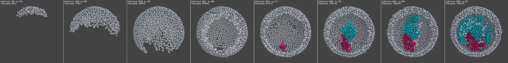

# Mastodon-Simulator Project

Initially developed to benchmark [Mastodon](https://github.com/mastodon-sc/)’s data handling capabilities and
challenge its theoretical limits, a simulator for a growing cell population was implemented directly within Mastodon,
and is openly available here.

The simulator is technically an agent-based system in 3D Cartesian space, where agents are defined
as rigid spheres with varying radii and fixed mass.

*More details and illustrations TBA...*

*Example of a gastrulation-like simulation: Simulated in Mastodon and rendered using Blender using
[the bridge](https://github.com/mastodon-sc/mastodon-blender-view).*

## Authors
- [Vladimír Ulman](https://orcid.org/0000-0002-4270-7982), simulation framework and development
- [Johannes Girstmair](https://orcid.org/0000-0001-9029-3625), great ideas and conceptual contributions, and testing
